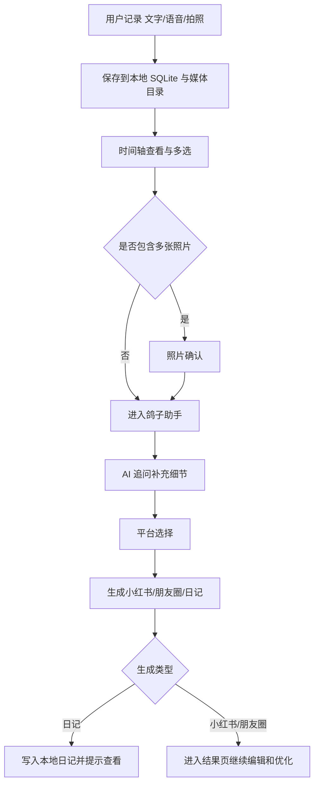

# travel bird（旅行的鸽子）

## 0. 基本信息

### 0.1 团队编号
kbzh

### 0.2 作品名称
travel bird（旅行的鸽子）

### 0.3 团队成员
Wang

### 0.4 团队分工
- 产品设计、前端开发、后端开发、AI 设计与调试均由本人完成

### 0.5 站点地址
- 访问链接：本作品当前为本地运行的 Web 演示版，提交时以代码包（zip）方式提供；评审可按 README 中的本地启动方式运行后，通过 `http://localhost:3000` 或局域网地址访问
- 测试账号/口令（如需）：无需登录

### 0.6 代码包
- zip/仓库链接（二选一）：代码包（zip）
- （如仓库）commit：无，本作品以本地代码包方式提交

## 1. 背景与问题定义

### 1.1 背景（1段）
旅行和日常生活中，用户会随手留下很多碎片内容，比如一句感受、一段语音、一张照片，但这些内容往往只停留在“记下来了”，很难进一步整理成适合分享或长期留存的成品。`travel bird` 希望把“轻记录”和“AI 生成”接到同一条链路里：先尽可能低门槛地收集真实片段，再利用 AI 帮用户补全细节、整理上下文，并生成适合小红书、朋友圈或私密日记的内容。原始设想是做成移动端 App，但由于时间限制，本次提交版本先实现为可本地运行的 Web 演示版，用来完整验证核心产品流程。

### 1.2 目标用户
- 有旅行记录和分享习惯的用户
- 日常探店、散步、通勤时会随手记录灵感的人
- 想表达但不想花太多时间整理文案的轻度创作者

### 1.3 核心使用场景
- 旅行途中看到风景、吃到美食时，快速拍照或录音留痕
- 一天结束后，从多条碎片记录中生成一篇可发布内容
- 不想公开分享时，把当天记录沉淀成一篇个人日记

### 1.4 痛点（3-5条）
- 记录方式分散，照片、语音、文字难以串联
- 当下有感受，但事后很难回忆细节
- 想发内容，但整理平台文案成本高
- 语音和照片素材本身不能直接成为可发布内容
- 很多内容适合留存，但缺少低成本的日记沉淀工具

### 1.5 成功标准（你们认为做成是什么样）
- 用户能在几秒内完成一次文字、语音或拍照记录
- 用户能从时间轴中勾选多条记录，一次性生成内容
- AI 不是只给“空泛文案”，而是能基于上下文补全细节
- 日记能真实保存到本地，刷新或重开后仍可查看

## 2. 系统概述

### 2.1 一句话方案
一个本地优先的旅行记录 Web 应用：用最轻量的方式记录当下，再通过 AI 把碎片整理成可分享内容或本地日记。

补充说明：本作品原计划形态为 App，本次提交版本为 Web 演示版，用于验证记录、整理、生成、沉淀这条核心闭环。

### 2.2 输入/处理/输出
- 输入：
  - 文字记录
  - 语音记录
  - 拍照记录
  - 用户在 AI 对话中的补充信息
- 处理：
  - 保存记录到本地 SQLite
  - 保存图片/音频到本地媒体目录
  - 异步补全地址信息
  - 语音转写为文本
  - AI 追问、抽取补充信息、生成目标内容
- 输出：
  - 时间轴中的结构化记录
  - 回写到记录上的 AI 补充信息
  - 小红书文案
  - 朋友圈文案
  - 本地日记

### 2.3 核心页面与入口
- 首页：鸽子按钮是主入口，支持单击文字、长按录音、上滑拍照
- 时间轴：查看所有记录，支持日/周/月视图、多选、编辑、删除
- 照片确认页：多张照片进入 AI 前二次勾选
- 鸽子助手页：AI 多轮提问、平台选择、开始生成
- 结果页：查看并编辑小红书/朋友圈生成结果，支持复制、AI 优化、撤销优化、重新生成
- 我的：查看统计、进入日记列表、语音转文字模型、Prompt 模板设置
- 日记页：查看、编辑、删除日记

### 2.4 流程图（可用 mermaid 或图片链接）：【选填】


### 2.5 功能清单（逐行列出系统支持的所有功能，评审将逐项验证）

| 功能名称 | 入口/操作路径 | 预期结果 |
|---|---|---|
| 文字记录 | 首页 → 单击鸽子 → 输入文字 → 保存 | 新增一条 `text` 记录，时间轴可见 |
| 文字记录附图 | 首页 → 单击鸽子 → 上传照片 → 保存 | 新增一条文字记录，并附带最多 3 张图片 |
| 语音记录 | 首页 → 长按鸽子 → 松手结束 | 新增一条 `voice` 记录，稍后自动转写为文本 |
| 拍照记录 | 首页 → 上滑鸽子 → 拍照/选图 → 保存 | 新增一条 `photo` 记录，时间轴可见 |
| 照片语音补充 | 拍照后预览页 → 按住说话 → 保存 | 转写文本回填到照片说明中 |
| AI 自动补照片说明 | 拍照后不填说明直接保存 | 系统尝试自动生成简短中文照片说明 |
| 时间轴浏览 | 时间轴 → 切换日/周/月 | 不同粒度查看记录 |
| 记录编辑 | 时间轴 → 单条记录 → 编辑 | 修改后的内容立即更新 |
| 单条删除 | 时间轴 → 单条记录 → 删除 | 记录从时间轴消失 |
| 批量选择 | 时间轴 → 选择 | 出现已选数量和操作栏 |
| 多记录进入 AI | 时间轴 → 多选 → 生成内容 | 进入鸽子助手 |
| 照片二次确认 | 多选中存在多张照片 → 选择照片 → 确认 | 仅把勾选照片带入 AI |
| AI 对话补充 | 鸽子助手 → 回复问题 | 补充信息参与后续生成 |
| 跳过对话 | 鸽子助手 → 跳过 | 直接进入平台选择 |
| 生成小红书文案 | 鸽子助手 → 选择小红书 | 生成标题、正文、标签并进入结果页 |
| 生成朋友圈文案 | 鸽子助手 → 选择朋友圈 | 生成朋友圈文案并进入结果页 |
| 存为日记 | 鸽子助手 → 选择存为日记 | 自动写入本地日记并提示查看 |
| AI 补充回写 | 对话结束或生成结束后 | 选中记录写入 `ai_supplement` |
| 结果页复制 | 结果页 → 复制 | 生成内容复制到剪贴板 |
| AI 优化 | 结果页 → AI优化 → 输入要求 | 当前内容被重新优化 |
| 撤销优化 | 结果页 → 撤销优化 | 回到上一个版本 |
| 重新生成 | 结果页 → 重新生成 | 返回助手并重新选择平台生成 |
| 查看日记 | 我的 → 我的日记 | 显示历史日记列表 |
| 编辑日记 | 我的 → 我的日记 → 日记详情 | 修改后保存成功 |
| 删除日记 | 我的 → 我的日记 → 日记详情 → 删除 | 日记从列表消失 |
| 模型设置 | 我的 → 语音转文字模型 | 保存语音与 AI 相关配置 |
| Prompt 设置 | 我的 → Prompt 模板设置 | 修改或重置 6 个 Prompt |

### 2.6 关键依赖：【选填】
- `Express`
- `better-sqlite3`
- `multer`
- `luxon`
- `ws`
- `@ffmpeg-installer/ffmpeg`
- `fluent-ffmpeg`
- Anthropic Messages API 或 OpenAI 兼容接口
- 字节跳动 BigModel ASR WebSocket 接口

### 2.7 关键状态反馈说明（加载中/操作成功/操作失败 如何体现）
- 保存中：按钮文案变化，如“保存中...”
- 转写中：Toast 提示“正在保存并转写...”或“正在转写...”
- 生成中：鸽子助手进入专门的“正在为你生成内容...”状态页
- 成功：Toast 提示“记录成功”“语音转写完成”“已存入日记”等
- 失败：Toast 提示错误原因，如 API Key 未配置、音频转写失败、AI 调用失败

## 3. 存储模块说明

### 3.1 存储的对象是什么（数据/状态）
- 用户记录：文字、语音、照片
- 记录元数据：时间、坐标、地址、分组、AI 补充信息
- 日记内容
- 模型配置与 API Key
- Prompt 模板
- 图片与音频媒体文件

### 3.2 存储位置与技术形态（文件/SQLite/数据库/平台内置表等）
- 结构化数据：本地 SQLite，文件位置为 `server/pigeon.db`
- 图片和音频：本地文件目录 `server/media/`
- 服务端运行方式：本地 `Express` 服务

### 3.3 数据结构（表/字段/示例）

#### 表 1：`records`

| 字段 | 含义 |
|---|---|
| `record_id` | 记录 ID |
| `type` | `text` / `voice` / `photo` |
| `content` | 文字内容或语音转写文本 |
| `media_filename` | 单个媒体文件名 |
| `media_filenames` | 多图文件名数组（JSON 字符串） |
| `caption` | 照片说明 |
| `voice_media_filename` | 照片附带语音文件 |
| `created_at` | 创建时间 |
| `latitude` / `longitude` | 坐标 |
| `address` | 地址文本 |
| `group_id` | 分组 ID |
| `ai_supplement` | AI 补充摘要 |
| `is_deleted` | 是否软删除 |

示例：

```json
{
  "record_id": "9b7c...",
  "type": "photo",
  "content": null,
  "caption": "傍晚的湖面很安静，风有点凉",
  "media_filename": "1710000000_abcd12.jpg",
  "created_at": "2026-03-24T08:00:00.000Z",
  "address": "西湖 · 湖滨步道",
  "ai_supplement": "那天刚下完雨，风吹过来很舒服"
}
```

#### 表 2：`diaries`

| 字段 | 含义 |
|---|---|
| `diary_id` | 日记 ID |
| `title` | 标题 |
| `content` | 日记正文 |
| `record_ids` | 关联记录 ID 数组 |
| `platform` | 当前为 `diary` |
| `created_at` / `updated_at` | 创建与更新时间 |

#### 表 3：`settings`

用于保存：
- `voice_api_key`
- `assistant_provider`
- `assistant_endpoint`
- `assistant_api_key`
- `assistant_model`
- `assistant_temperature`
- `assistant_max_tokens`

#### 表 4：`prompts`

保存 6 个可覆盖默认值的 Prompt：
- `p1_assistant`
- `p2_supplement`
- `p3_xiaohongshu`
- `p4_moments`
- `p5_diary`
- `p6_optimize`

### 3.4 演示中体现的存储行为（写入/查询/更新/删除中的哪些）
- 写入：新建文字、语音、照片记录；保存日记；保存设置；保存 Prompt
- 查询：时间轴加载记录；日记列表加载；设置页读取配置
- 更新：编辑记录；回写 `ai_supplement`；编辑日记；更新 Prompt
- 删除：软删除记录；删除日记

### 3.5 数据查看与验证方式（评审如何确认数据真的被保存、刷新后如何找回）
- 新建记录后，切换到时间轴应立即可见
- 刷新浏览器或重启服务后，时间轴与日记仍能重新加载出来
- 进入“我的 → 我的日记”能看到已生成的日记
- 如需进一步验证，可检查本地 `server/pigeon.db` 与 `server/media/`

### 3.6 初始化/重置方式（评审如何从 0 跑起来或看到数据）
- 首次启动后会自动创建 SQLite 数据库和数据表
- 如需从 0 开始演示，可停止服务后删除：
  - `server/pigeon.db`
  - `server/media/` 内测试文件
- 重新启动后系统会自动初始化空库

## 4. AI 使用说明

### 4.1 AI 在作品中的作用（AI 实际解决了什么问题）
- 帮用户把碎片记录整理为可生成的上下文
- 主动发问，帮助用户补齐“当时发生了什么、感受是什么”
- 从对话中抽取新增信息，并回写到对应记录
- 按目标平台生成不同风格的内容
- 对已生成内容做定向优化
- 在照片缺少说明时，自动生成简短画面总结

### 4.2 AI 能力如何触发（用户从哪里触发、输入什么、得到什么结果）
- 触发入口 1：时间轴多选记录 → 生成内容
  - 输入：用户选中的记录 + 用户对话补充
  - 输出：小红书文案 / 朋友圈文案 / 日记
- 触发入口 2：结果页 → AI优化
  - 输入：当前生成内容 + 用户优化指令
  - 输出：优化后的新版本内容
- 触发入口 3：照片保存时未填写说明
  - 输入：照片本身
  - 输出：自动生成的简短中文说明

### 4.3 Prompt / 上下文设计（提示词思路、上下文来源、约束方式）
- Prompt 采用分阶段设计，而不是单个万能 Prompt
- 上下文来源：
  - 选中记录的文字内容
  - 语音转写结果
  - 照片说明
  - 地址与时间
  - 用户在对话中的新增回答
- 约束方式：
  - 对话 Prompt 要求一次只问一个问题
  - 补充抽取 Prompt 要求按记录 ID 输出 JSON
  - 平台生成 Prompt 分别限定输出格式和语气
  - 优化 Prompt 要求“只改用户提到的部分”

### 4.4 质量控制方式（如何减少幻觉/如何验收）
- 优先使用用户真实记录作为上下文，减少凭空编造
- 照片总结要求“只描述画面中清晰可见内容”
- 补充信息回写时按记录 ID 映射，避免多记录串写
- 平台内容生成后保留人工可编辑环节，不强制直接发布
- 结果页支持重新生成和撤销优化，便于人工验收

### 4.5 人在回路（哪些环节必须人工确认）
- 用户需要自己选择哪些记录进入 AI
- 多张照片进入 AI 前，需要用户二次勾选
- 平台类型由用户手动选择
- 生成结果是否可发布，必须由用户在结果页人工确认
- AI 优化方向由用户自己输入指令决定

## 5. AI 辅助开发说明

### 5.1 你如何用 Cursor/大模型推进（需求拆解/实现/调试/优化）
- 用 AI 辅助梳理产品PRD
- 用 AI 辅助产出技术落地方案
- 用 AI 辅助梳理产品链路和页面结构，把“记录 → 时间轴 → AI 生成 → 日记沉淀”拆成独立模块
- 用 AI 辅助生成和重构前后端代码骨架，包括 API、数据库表结构、页面模块
- 用 AI 辅助定位语音转写、流式输出、移动端手势和页面状态切换等问题
- 用 AI 辅助补全文档，包括 PRD、README 和演示材料

### 5.2 关键提示词/对话片段（至少3条，可脱敏）
1. “请基于当前项目结构，把时间轴从单一列表改成支持日/周/月折叠浏览，同时不要破坏现有多选进入 AI 的流程。”
2. “请检查语音转写链路：浏览器录音 → 后端 ffmpeg 转码 → WebSocket ASR，重点排查为什么音频已保存但转写结果没有回写到记录。”
3. “请把 AI 生成流程拆成对话补充、平台选择、内容生成三个阶段，并设计状态机，要求结果页支持 AI 优化与撤销。”

### 5.3 验收方式与防幻觉策略（如何验证 AI 生成结果可用）
- 所有 AI 结果都必须落在可见页面中，便于人工检查
- 对话补充会回写到记录，便于比对是否映射正确
- 日记生成后必须能在日记列表中重新找到
- 小红书/朋友圈结果必须可复制、可编辑、可重新生成

## 6. 使用与演示说明

### 6.1 关键路径（一步步写清楚：谁 → 在什么场景 → 解决什么问题 → 怎么用系统完成；评审能照着走一遍完整闭环）
场景：一位旅行用户在一天中拍了照片、说了几句感受，晚上想快速整理成可发内容。

1. 用户打开首页。
2. 单击鸽子，输入一句当天感受并保存。
3. 长按鸽子，说一段语音，松手结束，等待系统自动转写。
4. 上滑鸽子，拍一张照片，在预览页补一句说明后保存。
5. 切换到时间轴，确认三条记录都已出现。
6. 点击“选择”，勾选这几条记录，点击“生成内容”。
7. 如果有多张照片，进入“选择照片”页做二次确认。
8. 进入鸽子助手，回答 1-2 轮问题，补充当时的感受和细节。
9. 选择“发小红书”或“发朋友圈”：
   - 若选“小红书/朋友圈”，进入结果页继续编辑、复制、AI 优化。
   - 若选“存为日记”，系统直接保存到本地日记，并可点击查看。
10. 进入“我的 → 我的日记”，验证刚才保存的日记是否仍然存在。

### 6.2 推荐测试账号 / 测试数据（如有）
- 无需登录
- 建议现场使用真实拍照、文字、语音快速演示

### 6.3 评审专用测试说明

本作品以本地代码包（zip）方式提交。评审解压后，可在项目根目录执行：

```bash
npm install
npm start
```

如在 macOS 上评审，也可直接双击项目根目录中的 `start-travel-bird.command` 启动。该文件为项目唯一启动脚本，会自动安装依赖（首次运行）并打开浏览器。

启动成功后，默认访问地址为：
- HTTP：`http://localhost:3000`
- HTTPS：`https://localhost:3443`（仅在已生成证书时可用）

首次启动时，系统会自动创建：
- 本地数据库：`server/pigeon.db`
- 媒体目录：`server/media/`

#### 6.3.1 可直接体验的功能（开箱即用）
- 首页加载与页面切换
- 文字输入并保存记录
- 上传照片并保存记录
- 时间轴查看记录
- 本地日记的保存、查看、编辑、删除
- 本地数据刷新后仍可找回

#### 6.3.2 有前置条件的功能
- 地址信息回填：
  - 需要浏览器允许定位权限
  - 需要评审环境可访问外部地理编码服务
- AI 对话、AI 生成、AI 优化、照片自动补说明：
  - 需要在“我的 → 语音转文字模型”中填写可用的 `assistant_provider / assistant_endpoint / assistant_api_key / assistant_model`
- 语音转文字：
  - 需要在“我的 → 语音转文字模型”中填写可用的 `voice_api_key`
- 手机端录音：
  - 需要使用 HTTPS 地址访问
  - 需要先生成 `server/certs/cert.pem` 与 `server/certs/key.pem`

#### 6.3.3 推荐评审顺序
1. 启动项目后，用电脑浏览器打开 `http://localhost:3000`
2. 在首页单击鸽子，输入一段文字并保存
3. 在首页上传或拍摄一张照片并保存
4. 切换到时间轴，确认文字和照片记录均已出现
5. 进入“我的 → 我的日记”，测试日记查看或编辑
6. 如需体验 AI，再进入“我的 → 语音转文字模型”补齐相关配置后继续测试

#### 6.3.4 如需测试手机端麦克风

请先在项目根目录执行：

```bash
cd server/certs
openssl req -x509 -newkey rsa:2048 -keyout key.pem -out cert.pem -days 365 -nodes -subj "/CN=localhost"
```

然后重启服务，并使用启动日志中打印出的局域网 HTTPS 地址在手机浏览器中访问。首次访问自签名证书地址时，需要在浏览器中手动选择继续访问。

### 6.4 常见失败与兜底（无权限/无数据/打不开时怎么处理）
- 麦克风不可用：
  - 手机请走 HTTPS 地址
  - 浏览器中允许麦克风权限
- AI 无法调用：
  - 进入“我的 → 语音转文字模型”补齐 `voice_api_key`
  - 补齐 AI 助手的 `provider / endpoint / api_key / model`
- 页面打不开：
  - 确认本地服务已启动在 `3000` 或 `3443`
- 没有数据：
  - 先在首页手动创建 2-3 条测试记录再演示 AI

### 6.5 本地启动方式：【选填】

推荐方式一：终端启动

```bash
npm install
npm start
```

推荐方式二：macOS 双击启动

- 直接双击项目根目录中的 `start-travel-bird.command`
- 脚本会自动安装依赖（首次运行）、启动服务，并打开浏览器

开发模式：

```bash
npm run dev
```

默认地址：
- HTTP：`http://localhost:3000`
- HTTPS：`https://localhost:3443`

如需手机端麦克风，请先生成自签名证书：

```bash
cd server/certs
openssl req -x509 -newkey rsa:2048 -keyout key.pem -out cert.pem -days 365 -nodes -subj "/CN=localhost"
```

### 6.6 评审验证点（按“操作 -> 预期结果 -> 如何确认”的方式列出）
- 操作：首页单击鸽子保存文字
  - 预期结果：新增文字记录
  - 如何确认：时间轴出现新记录
- 操作：首页长按鸽子录音
  - 预期结果：新增语音记录并转写
  - 如何确认：时间轴中该记录的正文从“待转写”变成转写文本
- 操作：首页上滑拍照并保存
  - 预期结果：新增照片记录
  - 如何确认：时间轴看到缩略图和说明
- 操作：时间轴多选记录进入 AI
  - 预期结果：进入鸽子助手并出现 AI 首轮提问
  - 如何确认：助手页展示对话消息
- 操作：选择“存为日记”
  - 预期结果：生成完成后提示“已存入日记”
  - 如何确认：我的日记列表中出现新条目
- 操作：选择“小红书”并点击 AI 优化
  - 预期结果：结果页内容变化
  - 如何确认：文本更新，且“撤销优化”按钮可用

## 7. 成效评估【选填，建议填写】

### 7.1 指标口径（定义清楚）
- 单次记录耗时：用户完成一次记录所需时间
- 生成闭环完成率：从多选记录到得到可用成稿的完成率
- 日记沉淀率：生成后选择存为日记的比例

### 7.2 结果（如节省时长、转化提升、产能提升等）
当前为作品阶段，尚未进行正式用户实验，暂未产出稳定量化数据。

### 7.3 证据（截图/对比/日志/样例数据结果）
- 可在演示视频中展示完整闭环
- 可通过时间轴、结果页、日记列表三处界面交叉验证

## 8. 风险与合规

### 8.1 数据来源与脱敏策略
- 是否使用真实用户数据：否
- 如否：模拟数据生成规则：
  - 演示中的文字、照片、语音均由开发/演示人员现场录入
  - 不依赖外部批量导入的真实用户数据
- 是否涉及未成年人信息：否

### 8.2 版权与引用说明
- 使用的第三方素材/内容来源（链接或说明）：
  - 代码依赖来自 npm 开源包：`express`、`better-sqlite3`、`luxon`、`multer`、`ws`、`fluent-ffmpeg` 等
  - AI 能力接入第三方模型接口，由使用者自行配置
- 是否包含未授权图片/视频/音乐：否

### 8.3 对外披露限制说明
- 是否计划对外发布：否（当前提交版本不对外公开发布，后续有可能继续完善后再发布）
- 如是：必须在发布前获得批准（说明审批人/流程）：若后续发布，将由作者本人确认内容、素材版权、隐私与模型配置合规后再行发布

## 9. 下一步【选填】

### 9.1 若给予资源支持，2-4周内可落地的计划
- 增加“生成内容历史中心”，统一查看曾生成的小红书/朋友圈内容
- 完善导出与数据库管理功能
- 优化时间轴中的自动分组展示
- 增加更多平台模板，如微博、公众号、短视频脚本
- 增加更完整的隐私与安全说明页
